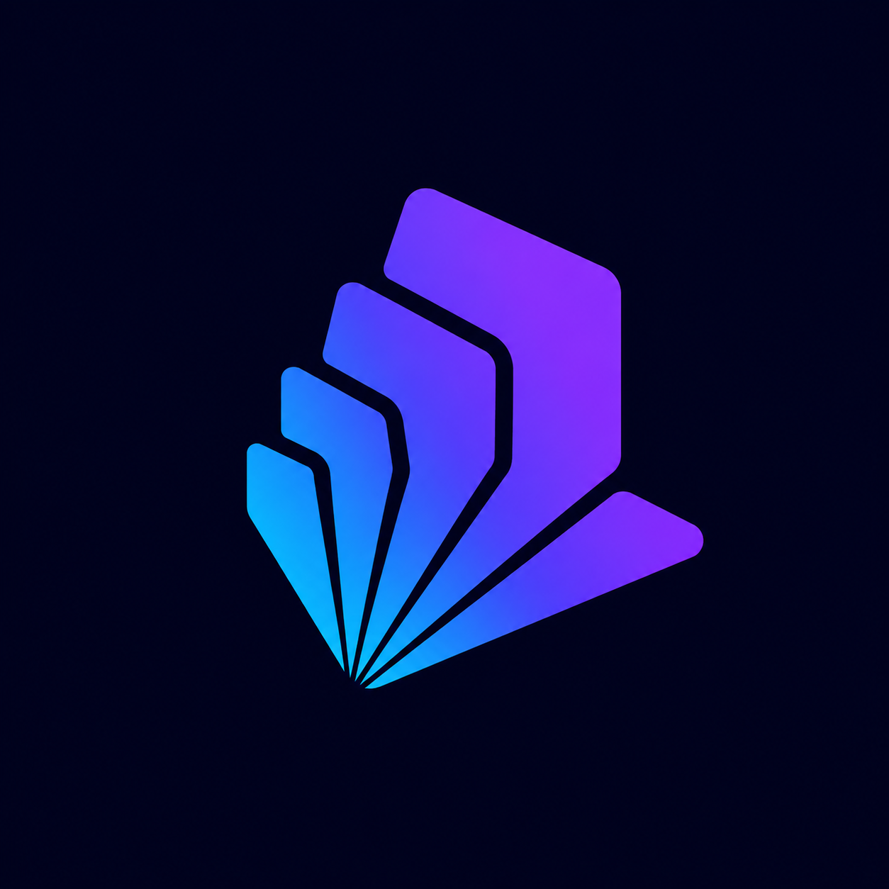

<p align="center">
  
</p>

# Deckle

**Local Windows tools, in one app — choose the capabilities you need.**

Dictate into any app. Restore the accents you skipped. Add three-finger drag to your trackpad. Let your Hue lights follow the screen. Deckle gathers these small Windows tools behind one native shell and one tray icon.

**[Get the newest release](https://github.com/louisfifre/deckle/releases)** · [Explore the modules](#available-modules)

> **Personal project, early public release.** Windows 11 x64, unpackaged, and installed per user without administrator privileges.

<!-- Add the first product image here when available:
<p align="center">
  
</p>
-->

## Available modules

Deckle brings independent capabilities into one shared Windows shell. Choose them during setup, and revisit that selection later from Settings.

Pick only **Trackpad gestures**, for example, and Deckle leaves Dictation, Autocorrect, Ambient light, and Anytype inactive and out of Settings. Heavy runtimes and models are downloaded when a selected capability needs them; assets already present are kept so the capability can be enabled again without another download.

Deckle currently ships as one application bundle. Module selection controls what is prepared and shown; physically finer-grained packages are a future direction.

| Module | What it adds |
|---|---|
| **Dictation** | Voice transcription on a hotkey or from an audio file, through a local Whisper model. |
| **Rewrite** | An optional cleanup pass through a configured Ollama model. Requires Dictation. |
| **Autocorrect** | French-first accent restoration and conservative typo correction, enabled app by app. |
| **Ambient light** | Real-time screen color mapped to Philips Hue lights over the local network. |
| **Trackpad gestures** | Three-finger drag on a Windows precision touchpad. |
| **Anytype workspace** | A local Anytype backend and MCP surface that AI assistants can read and write. |

<!-- deckle-stats:start -->
## Development pulse

| First commit | Commits | Active days | Lines added | Lines touched | Current tracked lines |
|---:|---:|---:|---:|---:|---:|
| 2026-04-01 | 1,982 | 82 | 351,967 | 509,045 | 194,366 |

<sub>Generated from Git history on 2026-07-30. Counts include tracked text files only for the current line total.</sub>
<!-- deckle-stats:end -->

---

## Why Deckle

- **Local where it matters.** Speech recognition, autocorrect, and screen analysis run on your hardware.
- **No account or remote analytics.** There is nothing to subscribe to, and optional diagnostics stay in local files you can inspect and delete.
- **Native to Windows 11.** WinUI 3, system materials, a real tray menu, and per-user autostart make Deckle feel at home on the platform.
- **One shell, fewer background apps.** The capabilities share the small amount of infrastructure they genuinely need.

## A closer look

### Dictation

**Hold a hotkey, speak, release — your words land in the focused field or wait on the clipboard.** You can also send an audio file through the same local transcription pipeline and save the result.

Whisper runs locally with the model you choose, accelerated through Vulkan with a CPU fallback. Voice-activity detection trims silence, and an optional rewrite pass can clean up the transcript afterwards.

### Autocorrect

**Type without slowing down for every accent.** Deckle observes text only in apps you enroll and only while UI Automation confirms an editable, non-password field.

Corrections are deliberately conservative and reversible. The correction inlay lets you reject a change explicitly, while the personal vocabulary remains readable, editable, and removable.

### Ambient light

**Let Philips Hue lights follow the screen without sending frames anywhere.** Deckle captures frames on the GPU, maps screen regions to individual lights, and drives the bridge over the local network.

The color pipeline handles gamut limits and HDR displays; captured frames stay in GPU memory and are never written to disk. Ambient light is the newest major capability and is still evolving.

### Smaller desktop touches

- **Three-finger drag** gives a precision trackpad the drag gesture common on other platforms.
- **Taskbar cover** masks the taskbar with an opaque band when you want a cleaner screen edge.

<!-- Add the broader interface image here when available:
<p align="center">
  
</p>
-->

---

## Try Deckle

1. Download **Deckle-Setup** from the newest entry on the [releases page](https://github.com/louisfifre/deckle/releases).
2. Run it and choose the capabilities you want.
3. Deckle installs per user, fetches any missing assets those capabilities require, and starts in the tray.

There is no administrator prompt. To start Deckle at login, enable **Settings → General → Launch at startup**.

## Privacy and network use

- Speech recognition, autocorrect, and screen analysis run locally. Audio and ambient frames are not uploaded.
- Autocorrect never observes password fields and acts only in apps you enroll.
- Deckle sends no analytics. Optional diagnostic datasets are consent-gated and stored locally.
- Internet access is used to install and update Deckle and to download selected runtimes or models. Hue discovery can use Philips' service when requested.
- Rewrite contacts the Ollama endpoint you configure, which defaults to the local machine.

## On the workbench

Deckle is an early public release, and its capabilities differ in maturity. Dictation is the most established; Ambient light and richer rewrite flows are still taking shape. Read-aloud is scaffolded but dormant, and finer mouse-wheel control remains groundwork.

## Build from source

Bootstrap a fresh Windows 11 machine, then build and run:

```powershell
scripts/lib/bootstrap-dev-env.ps1              # .NET 10, VS 2026, tooling
scripts/lib/build-run.ps1 -Configuration Release
```

The interactive menu at `scripts/deckle.ps1` wraps the development workflows. Worker scripts, switches, and native-runtime sourcing are documented in [`scripts/README.md`](scripts/README.md).

## Contributing

Bug reports, reasoned proposals, and focused contributions are welcome. Ideas for extending the French-first corrector to other languages are especially useful; see [CONTRIBUTING.md](CONTRIBUTING.md) before opening a pull request.

## Built solo, with leverage

Deckle is also a record of what becomes possible when one product designer uses modern language models to reach deeper into architecture, native platform work, observability, and release discipline. That leverage shapes the project, but the result stays local, legible, and owned by its user.

## Acknowledgements

Built on [whisper.cpp](https://github.com/ggerganov/whisper.cpp), [WinUI 3](https://github.com/microsoft/microsoft-ui-xaml) and the [Windows App SDK](https://github.com/microsoft/WindowsAppSDK), the [Windows Community Toolkit](https://github.com/CommunityToolkit/Windows), [Win2D](https://github.com/microsoft/Win2D), the [Vulkan SDK](https://www.lunarg.com/vulkan-sdk/), and the [Philips Hue](https://developers.meethue.com/) Entertainment API. Full attributions are in [NOTICE.md](NOTICE.md).

## License

MIT — see [LICENSE](LICENSE).
