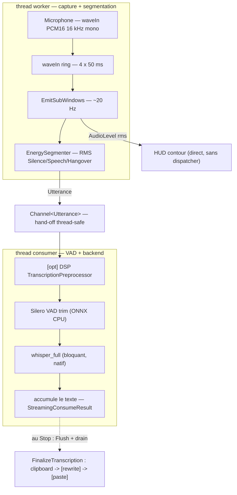
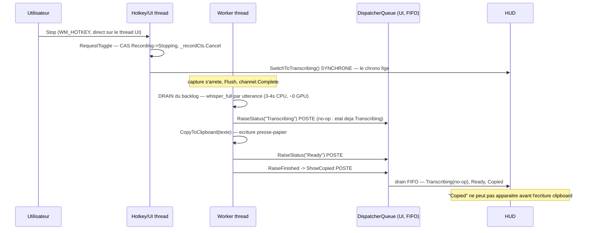

# Pipeline de transcription & synchronisation HUD

Carte de référence : du micro au presse-papier, et comment chaque message du HUD
se cale (ou non) sur l'état réel du pipeline.

**Principe directeur.** Le HUD doit coller à la peau des événements, pas maquiller
par-dessus. Une anticipation n'est légitime que si elle *est* l'état réel.

**Statut épistémique.** Les ordonnancements et couplages décrits ici sont
vérifiés dans le code (fichier:ligne en annexe). Les durées chiffrées au
conditionnel (ex. le « lead » du chrono) sont des interprétations non mesurées,
signalées comme telles.

Validé le 2026-06-07.

---

## 1. Pipeline physique (données + threads)

Chemin **streaming** (mode par défaut). Deux threads dans le chemin de données :
le worker (capture + segmentation) et le consumer (VAD + backend). Le contour
animé du HUD est nourri directement par `AudioLevel`, sans dispatcher.



Rendu texte (lisible partout, y compris Anytype) :

```
[worker]   Microphone  (OS waveIn: PCM16, 16 kHz, mono)
               |
[worker]   waveIn ring buffer -- 4 x 50 ms, CALLBACK_EVENT
               |                 (MicrophoneCapture / WaveInLoop.Pump)
               v
[worker]   EmitSubWindows -- 1 frame / 50 ms  (~20 Hz)
               |
               +---> AudioLevel(rms) .........> HUD contour (direct, sans dispatcher)
               |
               +---> Frame(CaptureFrame)
                         |
[worker]   EnergySegmenter -- machine a etats sur le RMS
               Silence -> Speech -> Hangover
                         |  emet une Utterance (zone voisee + marge)
                         |  a l'expiration du hangover (silence) ou au Flush (Stop)
                         v
           Channel<Utterance>  ===== hand-off thread-safe =====
                         |
[consumer]   await foreach (utterance)
                         |
[consumer]   [opt] DSP  TranscriptionPreprocessor (par utterance)
                         |
[consumer]   Silero VAD trim (ONNX CPU) -- jette l'utterance si pas de voix
                         |
[consumer]   WhisperBackend.whisper_full (bloquant, natif)
                         |  new_segment cb -> TranscriptionSegment (par phrase)
                         v
[consumer]   accumule le texte -> StreamingConsumeResult
                         |
           ===== au Stop: le worker Flush + attend le drain du consumer =====
                         |
[worker]   FinalizeTranscription
               clipboard (brut) -> [rewrite] -> clipboard (reecrit) -> [paste]
```

Variante **monolithique** : pas de segmenter, pas de Channel, pas de consumer.
Le worker capture toute la prise puis fait **un seul** `whisper_full` à la fin.
Conséquence clé : en monolithique le décodage a lieu *après* le Stop ; en
streaming il a lieu *pendant* que tu parles.

---

## 2. Machine à états du moteur (la vérité)

```mermaid
stateDiagram-v2
    [*] --> Idle
    Idle --> Starting: press (CAS Idle->Starting)
    Starting --> Idle: probe mic echoue / rollback
    Starting --> Recording: CAS ; spawn worker ; PRIME du modele
    Recording --> Stopping: press (CAS) ou cap-duree
    Stopping --> Transcribing: CAS Stopping->Transcribing
    Transcribing --> Idle: finalize termine (worker finally -> emet "Ready")
    Idle --> [*]
    note right of Idle
        Disposed : depuis n'importe quel etat
        (Dispose gagne tous les CAS)
    end note
```



Rendu texte :

```
         RequestToggle (hotkey)
               |
   +-----------v-----------+
   |         Idle          |<-----------------------------+
   +-----------+-----------+                              |
               | press  (CAS Idle -> Starting)            |
               v                                          |
         +-----------+   probe mic echoue / rollback      |
         | Starting  |------------------------------------+
         +-----+-----+                                    |
               | CAS Starting -> Recording                |
               | spawn worker ; PRIME du modele           |
               v                                          |
         +-----------+   press (CAS Recording -> Stopping)|
         | Recording |---------------+                    |
         +-----------+               |                    |
               | cap-duree (CAS)     v                    |
               |             +-----------+                |
               +------------>| Stopping  |                |
                             +-----+-----+                |
                                   | CAS Stopping -> Transcribing
                                   v                      |
                             +-------------+              |
                             | Transcribing|              |
                             +------+------+              |
                                    | finalize termine    |
                                    +---------------------+
                                    (worker finally: -> Idle, emet "Ready")

   Disposed : depuis n'importe quel etat (Dispose gagne tous les CAS)
```

---

## 3. Canaux d'affichage HUD & fidélité

Le HUD est piloté par quatre canaux indépendants, sur des threads différents.
Annotation : **FIDÈLE** = callé sur l'événement réel ; **ÉCART** = ne colle pas
encore tout à fait.

```
PRINCIPE: le HUD colle a la peau des evenements.
Une anticipation n'est legitime que si elle EST l'etat reel.

(1) STATUT moteur   [worker thread, poste FIFO sur le dispatcher]
  RaiseStatus("Recording"/"Transcribing"/"Rewriting"/"Ready")
        | StatusChanged --(StartsWith)--> App --EnqueueUI--> [UI] SetState
        |
        +-- Recording -> StartClock   [FIDELE au prime,
        |                               MAIS devance le 1er PCM de ~50-150ms]  <== ECART
        +-- Transcribing/Rewriting/Ready ...

(2) RACCOURCIS   [hotkey thread == UI thread, SYNCHRONE, aucun saut]
  Started   --> ShowPreparing()        -> Charging   [FIDELE: dure le prime reel]
  Stopped   --> SwitchToTranscribing() -> StopClock  [FIDELE: chrono fige a
                                                       l'instant du Stop]
  Finished  --> ShowCopied / ShowPasted             [FIDELE: apres l'ecriture
                                                       presse-papier reelle]
  ReadyToPaste --> HideSync()

(3) AUDIOLEVEL   [worker thread, inline, garde stroke-sync]
  AudioLevel(rms) --> OnAudioLevel --> contour   [FIDELE: ne bouge qu'une fois
                                                  SetState(Recording) applique]

(4) USERFEEDBACK   [thread emetteur]  -- erreurs/avertissements (module futur)
  EmitUserFeedback --> EventSource --> Listener --> Sink
        |-- role 0 --> Message (remplace le chrono)
        |-- role 1 --> Overlay (carte empilee)
```

### Ordonnancement au Stop (streaming)

Vue séquence : pourquoi « Copié » n'apparaît jamais avant l'écriture
presse-papier, et pourquoi le statut moteur « Transcribing » est un no-op.



---

## 4. Frise temporelle (streaming)

```
STREAMING (verifie : fidele, sauf le lead du chrono)

 press                                Stop press
   v                                     v
REAL |=prime=|== capture + decode LIVE des utterances ==|== DRAIN du backlog ==|=clip=|
               (whisper decode au fil de l'eau)           (whisper_full sur la   write
                                                           file restante : 3-4s
                                                           CPU, ~0 GPU)
HUD  |=Charging=|======= Recording (chrono court) =======|===== Transcribing ====|=Copied=|
      ^prime reel ^Recording                              ^StopClock SYNCHRONE     ^apres
                   devance le 1er PCM                       au Stop (hotkey thr) :   ecriture
                   de ~50-150ms  <== ECART                  le chrono se fige net,   presse-
                                                            couvre le drain reel     papier

  Le "Transcribing" cote moteur (apres drain) est un no-op : poste apres coup,
  l'etat est deja Transcribing. JAMAIS de "Transcribing par-dessus du copie".
```

Pour comparaison, **monolithique** : « Transcribing » recouvre alors le décodage
réel (qui n'a lieu qu'après le Stop), pas seulement le drain résiduel.

```
MONOLITHIQUE
 press                                Stop press
   v                                     v
REAL |=prime=|====== capture (AUCUN decodage) ======|== decode toute la prise ==|=clip=|
HUD  |=Charging=|========= Recording =============|========= Transcribing ======|=Copied=|
                                                  ^ ici "Transcribing" recouvre
                                                    le vrai decodage
```

---

## 5. Verdict de fidélité

Après vérification dans le code, le HUD est largement déjà fidèle :

- **Chrono figé au Stop** — `StopClock` part de `SwitchToTranscribing`, appelé
  *synchrone sur le thread du hotkey* : le chrono s'arrête pile au geste. L'arrêt
  *est* l'événement réel.
- **« Transcribing » non décoratif** — c'est l'état posé synchrone au Stop ; il
  couvre le drain réel du backlog (`whisper_full` sur la file restante), soit les
  quelques secondes observées sur CPU pour un gros morceau.
- **« Copié » synchronisé** — l'écriture presse-papier précède `ShowCopied`, tout
  est posté FIFO sur le même thread. Aucune fenêtre où « Transcribing » tournerait
  par-dessus un texte déjà copié.
- **Charging callé sur le prime** — lié à `EnsurePrimed` : long à froid,
  instantané à chaud, remplacé par le statut « Recording » et non par un timer.
- **Contour audio gardé** — `UpdateAudioLevel` n'écrit que si le stroke existe
  *et* que la variante == Recording. Le contour ne peut pas bouger avant que
  `SetState(Recording)` soit appliqué. La course réelle est l'inverse (audio vs
  démontage UI) et elle est déjà fermée par ce garde.

### Le seul écart résiduel

Le chrono démarre sur le statut « Recording », émis *avant* que `_capture.Record`
ait ouvert le micro et rempli son premier tampon. Le chrono devance donc le
premier PCM réel — *interprétation, non mesurée* : de l'ordre de quelques dizaines
à ~150 ms (ouverture du device + premier tampon de 50 ms). Un offset constant de
« temps fantôme » sur les centièmes affichés.

Piste, *quand on passera au code* : démarrer le chrono sur le premier frame audio
réel plutôt que sur l'émission anticipée du statut.

### Amélioration design (hors synchro)

Animer l'état Charging : même swipe que le chrono, mais chiffres en couleur
*primary* (celle du chrono en marche) au lieu de la couleur chrono. À traiter
quand on touchera la surface Hud.

---

## Annexe — ancrages (fichier:ligne)

- Chrono — `Deckle.Hud/HudChrono.Clock.cs` : `StartClock` (75), `StopClock` (87),
  `UpdateClock` lit `_stopwatch.Elapsed` (169) ; `ChronoTimer` (Deckle.Chrono).
- Lifecycle horloge — `Deckle.Hud/HudWindow.xaml.cs` : switch SetState (420),
  entrées publiques (244) ; `EnqueueUI` HasThreadAccess (512).
- Statut Recording — `Deckle.Transcription/.../StateMachine.cs:257` (après
  `EnsurePrimed` 248) ; routage `Deckle.App/App.xaml.cs:408`.
- Stop synchrone — `Deckle.App/App.Hotkeys.cs:64` (+ commentaire 54) ;
  hotkey direct sur thread UI `Deckle.Shell/HotkeyManager.cs:111`.
- Drain & no-op — `StreamingPipeline.cs` : `await consumer` (197),
  `whisper_full` par utterance (389), `RaiseStatus("Transcribing")` (237).
- Clipboard & fin — `Pipeline.cs` : `CopyToClipboard` (163), `RaiseFinished` (439) ;
  `App.xaml.cs` : Transcribing (411), Copied/Pasted (428/422).
- Contour audio — `App.xaml.cs:447` (sans dispatcher) ;
  `Deckle.Hud/HudChrono.Stroke.cs:87` (garde stroke-sync).
